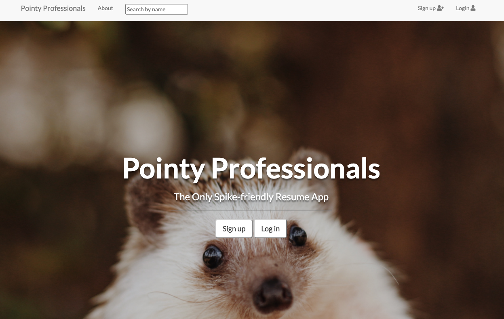
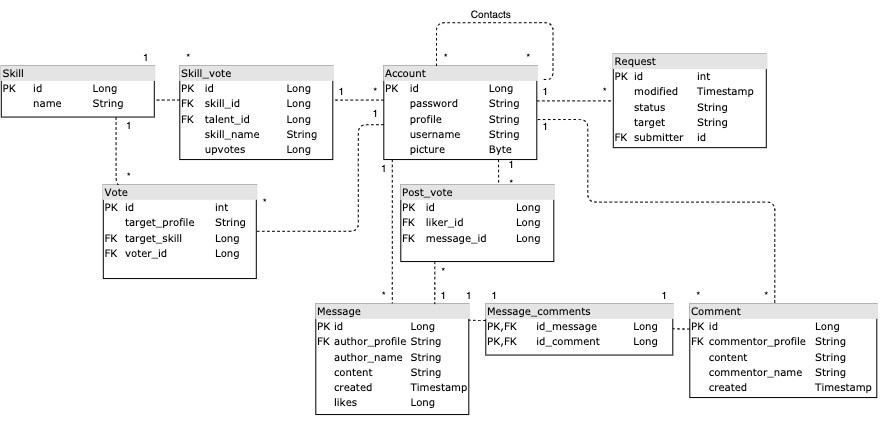

# Pointy Professionals Resume Application
This is a project for "Web programming with Java Spring" course from University of Helsinki.

Project entails a full-stack web application where the user may register and log in to the service where they can create themselves a professional portfolio. User can invite other users to their contact network and praise their skills.

Project is deployed to Heroku, build with Java Spring framework, Thymeleaf, HTML and Bootstrap CSS. Testing done with Junit and Fluentlenium.

[See here the live version of the project](https://pure-harbor-61781.herokuapp.com/)

 

### Lessons learnt during the project
* Fundaments of web development - core concepts like understanding HTTP requests and status codes or post-redirect-get modelling
* MVC architecture and how it compares to layered or micro service architectures
* Fragmenting and modularly designing the front of the application
* Creating and using configuration profiles for different development stages
* Adding different layers of tests from unit test to UI functionality testing
* Basic user authentication and authorization

## Service functionalities
* Users may register to the service and log in and out to the service
* User has their own profile where they may add a profile picture and list skills for other users to see - like a small resume
* Logged in user can vote any one other user’s skill. User’s skill can be voted only once by the same user.
* Logged in user may ask another user to become their contact from this user’s profile page. A request is send and when this request is accepted these two users become contacts.
* Unlogged user may only view profiles and search them by users full name.
* Logged in user can post content in the message board. Content will be show to all contacts the user has.
* Contacts may comment and like their posts and comments.

## Installation and starting the server
To run this project, download your favourite Java IDE and open this project in the IDE. To start the server find the file MyApplication.java and run the file. Application starts at http://localhost:8080/.

From terminal the application starts by running ```mvn spring-boot:run```

## Database
Below is a picture of the database structure:


